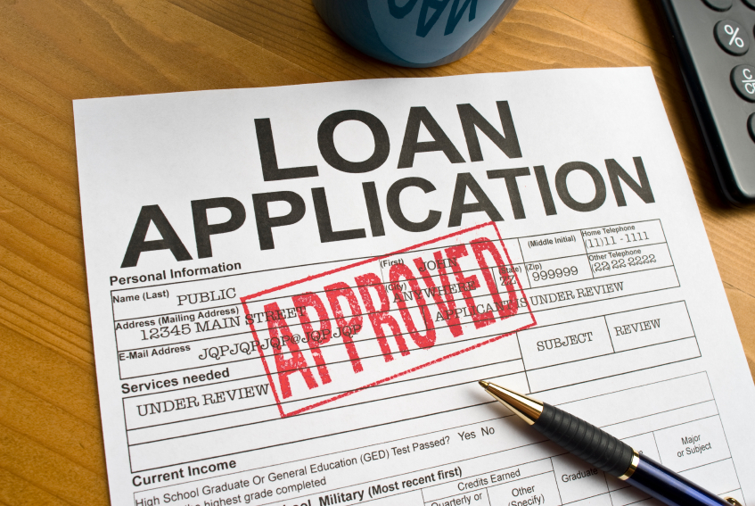
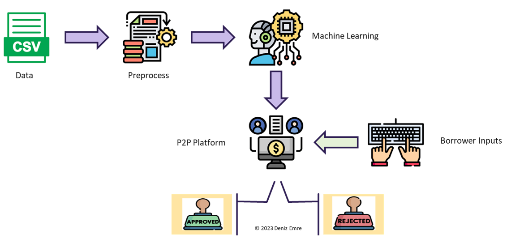

# Smart Lending: Leveraging Data to Reduce Loan Defaults

## Business Understanding 

**Loan Default:** 
Loan default occurs when a borrower fails to meet their contractual obligation of repaying a loan according to the agreed-upon terms. In the world of financial lending, the management of loan defaults is a critical concern for banks and lending institutions. Understanding the dynamics of loan defaults is essential to assess and mitigate risks in the lending business.

**The Loan Business:** 
The essence of the loan business lies in facilitating access to funds for individuals and businesses to meet various financial needs, such as buying homes, expanding businesses, or addressing unexpected expenses. Banks and lenders play a crucial role in this ecosystem by providing loans to borrowers, charging interest rates, and generating revenue from interest payments.

## Project Overview 

**Objective:**
The primary goal of this project is to analyze and address the challenges associated with loan defaults in the context of our lending institution. By leveraging data analysis and predictive modeling techniques, the project aims to optimize the loan approval process and reduce the risk of defaults.

**Motivation:** 

In the ever-changing world of finance, my project "Smart Lending: Leveraging Data to Reduce Loan Defaults" aims to harness data and machine learning to transform lending. I am motivated to strike the right balance between risk management and business growth, revolutionizing lending practices for lenders, investors, and borrowers.

## Data Understanding and Observations 
The Loan Default Dataset, sourced from Kaggle, includes 148,670 entries across 34 columns of synthetic applicant data. The Loan Default Dataset includes a "Status" column showing if a loan is defaulted or not, along with applicant details. The dataset presents an imbalanced class distribution, a common challenge in predictive modeling. This imbalance has been addressed using specialized methods during the pipeline stages to ensure a more balanced and representative model training process. Techniques such as SMOTE (Synthetic Minority Over-sampling Technique), random undersampling of the majority class, or adjusted class weighting in algorithms could be considered to mitigate this imbalance.

## Data Science in Loan Approval: An Overview

I created the above figure to provide a high-level overview of how data science integrates with the loan approval process. As  I mentioned before, the dataset contains historical loan applications. To improve lending, I have developed machine learning models that analyze financial information provided by borrowers on a P2P platform. These models evaluate the data to decide on loan application approval or rejection.

## Project Steps 
1. **Preprocessing**: During preprocessing, missing values were plotted and imputed according to their distribution. Columns irrelevant to loan approval, such as 'Application ID', were dropped. The 'Gender' column was removed from the dataset due to ethical considerations and to adhere to legal restrictions, such as those enforced by the Equal Credit Opportunity Act in the U.S., which discourage using gender as a predictor in loan default models.
   
2. **Modelling:**  I began modeling with a baseline dummy model, advancing through logistic regression, random forest, KNN, SVM, and XGBoost. The advanced models initially showed high accuracy, prompting a check for data leakage. To investigate, I used cross-validation for consistent performance across data subsets and separate preprocessing pipelines to ensure no test data influence. I carefully reviewed the feature selection after noting similar issues reported for this dataset. Later, implementing PCA helped mitigate overfitting by reducing dimensionality, addressing multicollinearity, and improving model generalization.
   
3.  **Deployment:** For deployment, I designed a prototype app that uses only five features for illustration. Users input their information, and the app predicts likely default or not. The code for the prototype app is available as 'loanDemo' in the main branch. 

## Results  

## Limitations
The dataset's synthetic nature may not capture real-world complexities. Key factors like credit scores and loan purpose are oversimplified, and the dataset may omit crucial features that affect loan approval accuracy.

## Next Steps 
### Risk Management Strategy: 
- Recognize multiple interpretations of risk.
- Conduct thorough risk evaluations to pinpoint high-impact cases.
- Base risk mitigation and model choices on strategic priorities.

### Domain Knowledge

- Leverage industry insights to identify and bridge data gaps.
- Aim for a diverse and representative dataset.

### Continuous Model Enhancement:

- Update models to reflect evolving risk factors and borrower behavior.
- Ensure models are regularly refined for precise risk assessment.

## Dependencies

The project utilizes the following libraries:

- Python 3.x
- NumPy
- Pandas
- Scikit-learn
- Matplotlib
- Seaborn
- XGBoost
- LightGBM
- TensorFlow

## License

This project is licensed under the MIT License - see the [LICENSE](LICENSE) file for details.

## External Links

Thank you for visiting my project. If you have feedback, feel free to reach out to me via [LinkedIn](https://www.linkedin.com/). I also have a [blog](https://medium.com/@deniizemre) where I post about Data Science and Operations Research!

